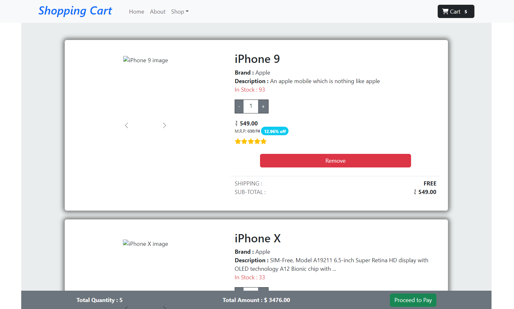

## React useContext Shopping Cart Page.

A dynamic shopping cart built with React Context API to manage item quantities, total quantity, and total amount. It updates automatically based on user interactions. This README guides you through the implementation and usage of the project.

